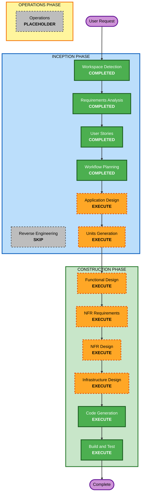

# Execution Plan

## Detailed Analysis Summary

### Transformation Scope (Brownfield Only)
- **Transformation Type**: N/A (Greenfield)
- **Primary Changes**: 新規プロダクトをゼロから構築
- **Related Components**: N/A

### Change Impact Assessment
- **User-facing changes**: Yes - 初心者向け動画生成UIと操作フローを新規提供
- **Structural changes**: Yes - フロントエンド、API、ストレージの新規構成
- **Data model changes**: Yes - YAML台本スキーマ、アセットマニフェスト定義
- **API changes**: Yes - 台本生成API新規作成
- **NFR impact**: Yes - セキュリティ、品質、性能、運用性に直接影響

### Component Relationships (Brownfield Only)
- N/A (Greenfield)

### Risk Assessment
- **Risk Level**: High
- **Rollback Complexity**: Moderate
- **Testing Complexity**: Complex

## Workflow Visualization

### Text Alternative

- INCEPTION: Workspace Detection -> Requirements Analysis -> User Stories -> Workflow Planning は完了
- INCEPTION次段: Application Design と Units Generation を実行
- CONSTRUCTION: Functional Design -> NFR Requirements -> NFR Design -> Infrastructure Design -> Code Generation -> Build and Test を実行
- OPERATIONS: 現時点はプレースホルダー

## Phases to Execute

### INCEPTION PHASE
- [x] Workspace Detection (COMPLETED)
- [x] Reverse Engineering (SKIPPED)
  - **Rationale**: Greenfieldのため既存コード解析は不要
- [x] Requirements Analysis (COMPLETED)
- [x] User Stories (COMPLETED)
- [x] Workflow Planning (COMPLETED)
- [ ] Application Design - EXECUTE
  - **Rationale**: 新規コンポーネント、責務分割、サービス境界の明確化が必要
- [ ] Units Generation - EXECUTE
  - **Rationale**: 複数領域を並行可能な実装単位へ分解する必要がある

### CONSTRUCTION PHASE
- [ ] Functional Design - EXECUTE
  - **Rationale**: YAML仕様、レンダリング、生成フローの詳細化が必要
- [ ] NFR Requirements - EXECUTE
  - **Rationale**: セキュリティ/PBT拡張適用と性能制約を明文化する必要がある
- [ ] NFR Design - EXECUTE
  - **Rationale**: NFRを設計へ落とし込む必要がある
- [ ] Infrastructure Design - EXECUTE
  - **Rationale**: Cloudflare Pages/Workers/R2構成を具体化する必要がある
- [ ] Code Generation - EXECUTE (ALWAYS)
  - **Rationale**: 実装本体
- [ ] Build and Test - EXECUTE (ALWAYS)
  - **Rationale**: 品質検証と実行手順整備

### OPERATIONS PHASE
- [ ] Operations - PLACEHOLDER
  - **Rationale**: 現在は将来拡張対象

## Package Change Sequence (Brownfield Only)
- N/A (Greenfield)

## Estimated Timeline
- **Total Stages (remaining executable)**: 8
- **Estimated Duration**: 6-10 weeks (MVP基準)

## Success Criteria
- **Primary Goal**: テーマ入力からWebMダウンロードまでをMVPとして成立させる
- **Key Deliverables**:
  - フロントエンドMVP
  - 台本生成API
  - YAML検証とプレビュー
  - WebM出力
- **Quality Gates**:
  - 受け入れ基準の達成
  - セキュリティ設計反映
  - PBT対象ロジックのテスト方針確立
